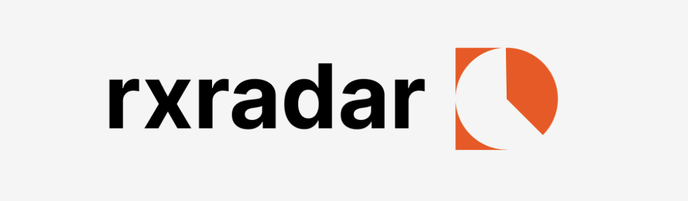

## Hi there 👋

# RxRadar -- [Live Site](https://rx-radar.com)
a project by Owen Dolan ([@odolan](https://www.github.com/odolan)) & Simon Sandrew ([@Simon-Sandrew](https://github.com/Simon-Sandrew))

RxRadar is an innovative solution designed to simplify the process of finding hard-to-access medications. By leveraging AI and automation, we streamline the search for available prescriptions, ensuring a hassle-free experience for patients.

*Note RxRadar is currently disabled and will not be accepting new search requests for the time being*
## Table of Contents

- [Project Overview](#project-overview)
- [Features](#features)
- [Repositories](#repositories)
- [System Architecture](#system-architecture)
- [Getting Started](#getting-started)
- [Contributing](#contributing)
- [License](#license)
- [Contact](#contact)

## Project Overview

RxRadar addresses the challenge of locating medications during shortages by:

1. Automatically searching for pharmacies in the user's area
2. Initiating direct communication through an AI system
3. Efficiently determining prescription availability

Our platform currently supports several commonly shortage-affected ADHD medications, including Adderall, Vyvanse, Focalin, Daytrana, and Ritalin.

## Features

- 🗺️ Interactive map with visually labeled pharmacies
- 🤖 AI-powered automated & scalable pharmacy calling service
- 💳 Integrated payment processing
- 🔍 Efficient search algorithm with caching
- 📊 Real-time developer monitoring and analytics

## Repositories

Our project is organized into several repositories, each serving a specific purpose:

### 1. rx-radar-site

**Frontend Website**

- Technologies: Next JS, Tailwind CSS, Google Cloud Platform, Firebase
- Description: The main user-facing application that interacts with our backend services.
- Key Functionalities:
  - User authentication
  - Payment processing
  - Pharmacy search initiation
  - Interactive results display
  - Appointment scheduling

### 2. get-pharmacies

**Pharmacy Location Service**

- Technologies: Google Places, custom Firestore db
- Description: Microservice for fetching nearby pharmacy data.
- Key Functionalities:
  - Cached database search
  - Google Places API integration
  - Geohashing of pharmacy data
  - Return of comprehensive pharmacy information (hours, location, brand)

### 3. dev-dashboard

**Development Monitoring Tool**

- Description: Internal tool for monitoring and managing the RxRadar system.
- Key Functionalities:
  - Real-time order tracking
  - Live call monitoring
  - Customer information management
  - System performance analytics

### 4. process-search-request

**Search Request Handler**

- Description: Backend service for processing user search requests.
- Key Functionalities:
  - Payment status verification
  - Location confirmation
  - Search validation
  - Pharmacy call queue management

### 5. create-call-twilio-bland & transfer-twillio-bland

**Call Initiation Services**

- Technologies: Google Cloud Functions, Twilio API, Bland
- Description: Microservices for initiating and managing automated calls.
- Key Functionalities:
  - Call queue processing
  - Twilio integration for call placement
  - Handoff to AI call automation system

### 6. call-completion-twilio-bland

**Call Analysis Service**

- Technologies: Google Cloud Functions, Natural Language Processing, Bland AI
- Description: Service for analyzing call outcomes and updating search results.
- Key Functionalities:
  - Transcript analysis
  - Conversation success determination
  - Medication availability assessment
  - User notification
  - Search result updates

## System Architecture

## License

All rights reserved. Unauthorized copying, modification, or redistribution of this code is strictly prohibited without explicit permission from the author.

## Contact

For any inquiries, please reach out to [odolan27@gmail.com](mailto:odolan27@gmail.com).

---

